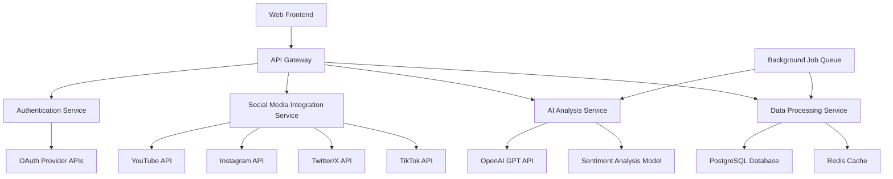

# Design Document

## Overview

The Comment Sentiment Analyzer is a web-based application that integrates with multiple social media platforms to fetch, analyze, and summarize comment sentiment for content creators. The system uses AI-powered natural language processing to provide actionable insights about audience reactions, helping creators understand their community engagement patterns.

## Architecture

### High-Level Architecture



### Technology Stack

- **Frontend**: React.js with TypeScript for type safety
- **Backend**: Node.js with Express.js framework
- **Database**: PostgreSQL with Prisma ORM for type-safe database operations
- **Cache**: Redis for session management and API response caching
- **AI/ML**: OpenAI GPT-4 for sentiment analysis and summarization
- **Queue**: Bull Queue with Redis for background job processing
- **Authentication**: Passport.js for OAuth integration
- **API Documentation**: Swagger/OpenAPI 3.0

## Components and Interfaces

### 1. Authentication Service

**Purpose**: Manages OAuth flows and token lifecycle for social media platforms

**Key Methods**:

- `initiateOAuth(platform: string, userId: string): Promise<AuthURL>`
- `handleCallback(platform: string, code: string): Promise<TokenData>`
- `refreshToken(platform: string, userId: string): Promise<TokenData>`
- `validateToken(platform: string, token: string): Promise<boolean>`

**Security Considerations**:

- Tokens encrypted at rest using AES-256
- Automatic token refresh 24 hours before expiration
- Rate limiting on authentication endpoints

### 2. Social Media Integration Service

**Purpose**: Abstracts platform-specific APIs into unified interface

**Key Methods**:

- `fetchUserPosts(platform: string, userId: string, limit: number): Promise<Post[]>`
- `fetchPostComments(platform: string, postId: string): Promise<Comment[]>`
- `validatePostAccess(platform: string, postId: string, userId: string): Promise<boolean>`

**Platform-Specific Implementations**:

- **YouTube**: Uses YouTube Data API v3 for video comments
- **Instagram**: Uses Instagram Basic Display API (limited to business accounts)
- **Twitter/X**: Uses Twitter API v2 for tweet replies
- **TikTok**: Uses TikTok for Developers API for video comments

### 3. AI Analysis Service

**Purpose**: Processes comments through AI models for sentiment and theme extraction

**Key Methods**:

- `analyzeSentiment(comments: Comment[]): Promise<SentimentResult>`
- `extractThemes(comments: Comment[]): Promise<Theme[]>`
- `generateSummary(sentimentData: SentimentResult, themes: Theme[]): Promise<string>`
- `detectSpamAndToxicity(comments: Comment[]): Promise<FilterResult>`

**AI Pipeline**:

1. **Preprocessing**: Clean and normalize comment text
2. **Spam Detection**: Rule-based filtering + ML classification
3. **Sentiment Analysis**: Multi-class classification (positive/negative/neutral)
4. **Emotion Detection**: Extract joy, anger, surprise, fear, sadness, disgust
5. **Theme Clustering**: Group similar comments using semantic similarity
6. **Summary Generation**: Use GPT-4 to create human-readable summaries

### 4. Data Processing Service

**Purpose**: Handles data persistence, caching, and background job coordination using Prisma ORM

**Key Methods**:

- `storeAnalysisResult(userId: string, postId: string, result: AnalysisResult): Promise<void>`
- `getCachedResult(postId: string): Promise<AnalysisResult | null>`
- `queueAnalysisJob(postId: string, comments: Comment[]): Promise<JobId>`
- `generateExportData(analysisId: string, format: string): Promise<ExportData>`

**Prisma Integration**:

- Type-safe database queries with auto-generated TypeScript types
- Database migrations managed through Prisma Migrate
- Connection pooling and query optimization handled by Prisma Client
- Built-in support for transactions and batch operations

## Data Models

### Prisma Schema Design

The following Prisma schema defines our database structure with proper relationships and constraints:

```prisma
// schema.prisma
generator client {
  provider = "prisma-client-js"
}

datasource db {
  provider = "postgresql"
  url      = env("DATABASE_URL")
}

model User {
  id                String              @id @default(cuid())
  email             String              @unique
  createdAt         DateTime            @default(now())
  updatedAt         DateTime            @updatedAt
  connectedPlatforms ConnectedPlatform[]
  posts             Post[]
  analysisResults   AnalysisResult[]

  @@map("users")
}

model ConnectedPlatform {
  id              String   @id @default(cuid())
  platform        Platform
  platformUserId  String
  accessToken     String   // encrypted
  refreshToken    String?  // encrypted
  tokenExpiresAt  DateTime?
  connectedAt     DateTime @default(now())
  userId          String
  user            User     @relation(fields: [userId], references: [id], onDelete: Cascade)

  @@unique([userId, platform])
  @@map("connected_platforms")
}

model Post {
  id               String           @id @default(cuid())
  platform         Platform
  platformPostId   String
  title            String
  url              String
  publishedAt      DateTime
  createdAt        DateTime         @default(now())
  userId           String
  user             User             @relation(fields: [userId], references: [id], onDelete: Cascade)
  comments         Comment[]
  analysisResults  AnalysisResult[]

  @@unique([platform, platformPostId])
  @@map("posts")
}

model Comment {
  id                String   @id @default(cuid())
  platformCommentId String
  text              String
  authorName        String
  publishedAt       DateTime
  likeCount         Int      @default(0)
  isFiltered        Boolean  @default(false)
  filterReason      String?
  createdAt         DateTime @default(now())
  postId            String
  post              Post     @relation(fields: [postId], references: [id], onDelete: Cascade)

  @@unique([postId, platformCommentId])
  @@map("comments")
}

model AnalysisResult {
  id                String              @id @default(cuid())
  totalComments     Int
  filteredComments  Int
  summary           String
  analyzedAt        DateTime            @default(now())
  postId            String
  userId            String
  post              Post                @relation(fields: [postId], references: [id], onDelete: Cascade)
  user              User                @relation(fields: [userId], references: [id], onDelete: Cascade)
  sentimentBreakdown SentimentBreakdown?
  emotions          Emotion[]
  themes            Theme[]
  keywords          Keyword[]

  @@map("analysis_results")
}

model SentimentBreakdown {
  id              String         @id @default(cuid())
  positive        Float
  negative        Float
  neutral         Float
  confidenceScore Float
  analysisResultId String        @unique
  analysisResult  AnalysisResult @relation(fields: [analysisResultId], references: [id], onDelete: Cascade)

  @@map("sentiment_breakdowns")
}

model Emotion {
  id               String         @id @default(cuid())
  name             String
  percentage       Float
  analysisResultId String
  analysisResult   AnalysisResult @relation(fields: [analysisResultId], references: [id], onDelete: Cascade)

  @@map("emotions")
}

model Theme {
  id               String         @id @default(cuid())
  name             String
  frequency        Int
  sentiment        Sentiment
  exampleComments  String[]
  analysisResultId String
  analysisResult   AnalysisResult @relation(fields: [analysisResultId], references: [id], onDelete: Cascade)

  @@map("themes")
}

model Keyword {
  id               String         @id @default(cuid())
  word             String
  frequency        Int
  sentiment        Sentiment
  contexts         String[]
  analysisResultId String
  analysisResult   AnalysisResult @relation(fields: [analysisResultId], references: [id], onDelete: Cascade)

  @@map("keywords")
}

enum Platform {
  YOUTUBE
  INSTAGRAM
  TWITTER
  TIKTOK
}

enum Sentiment {
  POSITIVE
  NEGATIVE
  NEUTRAL
}
```

### Generated TypeScript Types

Prisma will auto-generate TypeScript types based on the schema:

```typescript
// Generated by Prisma Client
import { User, ConnectedPlatform, Post, Comment, AnalysisResult, Platform, Sentiment } from "@prisma/client";

// Extended types with relations
type UserWithPlatforms = User & {
  connectedPlatforms: ConnectedPlatform[];
};

type PostWithComments = Post & {
  comments: Comment[];
  user: User;
};

type AnalysisResultWithDetails = AnalysisResult & {
  sentimentBreakdown: SentimentBreakdown | null;
  emotions: Emotion[];
  themes: Theme[];
  keywords: Keyword[];
  post: Post;
};
```

## Error Handling

### API Rate Limiting

- Implement exponential backoff for social media API calls
- Queue requests when rate limits are exceeded
- Notify users of delays due to platform limitations

### Authentication Errors

- Graceful handling of expired tokens with automatic refresh
- Clear error messages for failed OAuth flows
- Fallback mechanisms for temporary platform outages

### AI Service Failures

- Retry logic for transient AI API failures
- Fallback to cached results when possible
- Graceful degradation with basic sentiment analysis if advanced AI fails

### Data Validation

- Input sanitization for all user-provided data
- Validation of social media API responses
- Error logging with correlation IDs for debugging

## Testing Strategy

### Unit Testing

- **Coverage Target**: 90% code coverage
- **Framework**: Jest with TypeScript support
- **Focus Areas**:
  - AI analysis algorithms
  - Data transformation logic
  - Authentication flows
  - API integration layers

### Integration Testing

- **Social Media APIs**: Mock external API responses for consistent testing
- **Database Operations**: Use test database with transaction rollbacks
- **AI Services**: Mock AI API responses to test different scenarios

### End-to-End Testing

- **Framework**: Playwright for browser automation
- **Test Scenarios**:
  - Complete user journey from OAuth to analysis results
  - Multi-platform integration workflows
  - Export functionality across different formats

### Performance Testing

- **Load Testing**: Simulate concurrent analysis requests
- **API Response Times**: Target <2 seconds for analysis initiation
- **Memory Usage**: Monitor for memory leaks during large comment processing

### Security Testing

- **OAuth Flow Security**: Test for token leakage and CSRF attacks
- **Data Encryption**: Verify token encryption/decryption
- **Input Validation**: Test for injection attacks and malformed data
- **Rate Limiting**: Verify protection against abuse

## Deployment and Scalability Considerations

### Horizontal Scaling

- Stateless API services for easy horizontal scaling
- Background job processing can scale independently
- Database read replicas for improved query performance

### Caching Strategy

- Redis caching for frequently accessed analysis results
- CDN for static assets and export files
- API response caching with appropriate TTL values

### Monitoring and Observability

- Application performance monitoring (APM)
- Real-time error tracking and alerting
- Usage analytics for platform API consumption
- AI service cost and performance monitoring
