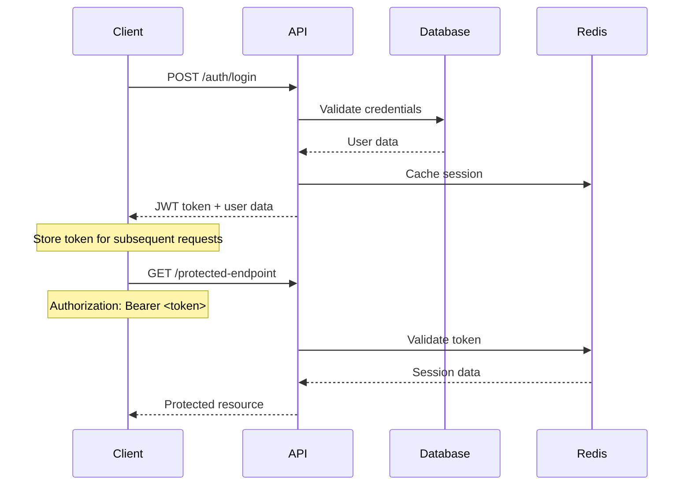
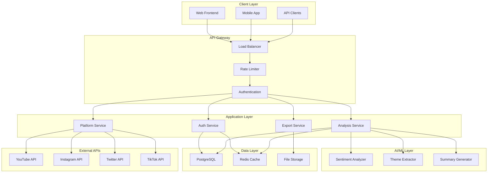
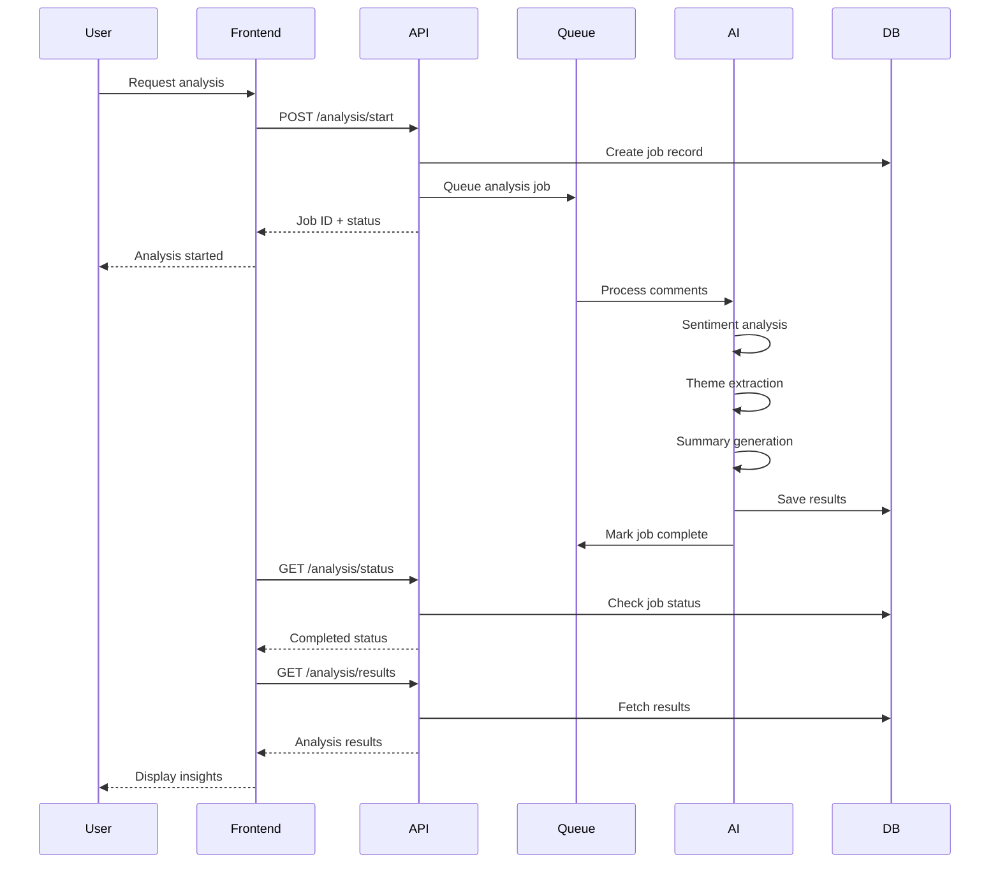

# Comment Sentiment Analyzer API Documentation

## Overview

The Comment Sentiment Analyzer API provides comprehensive sentiment analysis for social media comments across multiple platforms. This RESTful API enables content creators to connect their social media accounts, analyze comment sentiment, and gain actionable insights about their audience engagement.

## Table of Contents

1. [Authentication](#authentication)
2. [API Endpoints](#api-endpoints)
3. [Data Models](#data-models)
4. [Error Handling](#error-handling)
5. [Rate Limiting](#rate-limiting)
6. [Webhooks](#webhooks)
7. [SDKs and Examples](#sdks-and-examples)

## Authentication

The API uses JWT (JSON Web Token) based authentication. All protected endpoints require a valid JWT token in the Authorization header.

### Authentication Flow



### Token Management

- **Token Expiration**: 7 days by default
- **Refresh Strategy**: Automatic refresh 24 hours before expiration
- **Session Caching**: Redis-based session management for performance
- **Security**: Tokens are cached with expiration and invalidated on logout

## API Endpoints

### Authentication Endpoints

#### POST /auth/register

Register a new user account.

**Request Body:**

```json
{
  "email": "user@example.com",
  "password": "SecurePassword123!",
  "firstName": "John",
  "lastName": "Doe"
}
```

**Response:**

```json
{
  "success": true,
  "data": {
    "user": {
      "id": "user_123",
      "email": "user@example.com",
      "firstName": "John",
      "lastName": "Doe",
      "createdAt": "2024-01-15T10:30:00Z"
    },
    "token": "eyJhbGciOiJIUzI1NiIsInR5cCI6IkpXVCJ9...",
    "expiresAt": "2024-01-22T10:30:00Z"
  }
}
```

#### POST /auth/login

Authenticate existing user.

**Request Body:**

```json
{
  "email": "user@example.com",
  "password": "SecurePassword123!"
}
```

**Response:**

```json
{
  "success": true,
  "data": {
    "user": {
      "id": "user_123",
      "email": "user@example.com",
      "firstName": "John",
      "lastName": "Doe",
      "lastLoginAt": "2024-01-15T10:30:00Z"
    },
    "token": "eyJhbGciOiJIUzI1NiIsInR5cCI6IkpXVCJ9...",
    "expiresAt": "2024-01-22T10:30:00Z"
  }
}
```

#### GET /auth/profile

Get current user profile (requires authentication).

**Headers:**

```
Authorization: Bearer <jwt_token>
```

**Response:**

```json
{
  "success": true,
  "data": {
    "id": "user_123",
    "email": "user@example.com",
    "firstName": "John",
    "lastName": "Doe",
    "createdAt": "2024-01-15T10:30:00Z",
    "emailVerified": true
  }
}
```

### Platform Connection Endpoints

#### GET /platforms

Get all connected social media platforms.

**Response:**

```json
{
  "success": true,
  "data": {
    "totalConnected": 2,
    "activeConnections": 2,
    "errorConnections": 0,
    "platforms": [
      {
        "id": "platform_123",
        "platform": "YOUTUBE",
        "platformUserId": "UC123456789",
        "platformUsername": "johndoe",
        "connectedAt": "2024-01-10T15:20:00Z",
        "status": "active",
        "lastSyncAt": "2024-01-15T09:00:00Z"
      },
      {
        "id": "platform_456",
        "platform": "INSTAGRAM",
        "platformUserId": "17841401234567890",
        "platformUsername": "john.doe",
        "connectedAt": "2024-01-12T11:45:00Z",
        "status": "active",
        "lastSyncAt": "2024-01-15T08:30:00Z"
      }
    ]
  }
}
```

#### GET /platforms/connect/:platform

Initiate OAuth connection for a social media platform.

**Parameters:**

- `platform`: One of `youtube`, `instagram`, `twitter`, `tiktok`

**Response:**

```json
{
  "success": true,
  "data": {
    "authUrl": "https://accounts.google.com/oauth/authorize?client_id=...",
    "state": "random_state_string",
    "platform": "YOUTUBE"
  }
}
```

### Posts Endpoints

#### GET /platforms/posts

Fetch user's posts from connected platforms.

**Query Parameters:**

- `platform` (optional): Filter by platform (`YOUTUBE`, `INSTAGRAM`, `TWITTER`, `TIKTOK`)
- `limit` (optional): Number of posts to return (default: 20, max: 100)
- `page` (optional): Page number for pagination (default: 1)
- `dateFrom` (optional): Start date filter (ISO 8601)
- `dateTo` (optional): End date filter (ISO 8601)
- `search` (optional): Search query for post titles

**Response:**

```json
{
  "success": true,
  "data": {
    "items": [
      {
        "id": "post_123",
        "platform": "YOUTUBE",
        "platformPostId": "dQw4w9WgXcQ",
        "title": "Amazing Content Creation Tips",
        "url": "https://youtube.com/watch?v=dQw4w9WgXcQ",
        "publishedAt": "2024-01-10T12:00:00Z",
        "thumbnailUrl": "https://img.youtube.com/vi/dQw4w9WgXcQ/maxresdefault.jpg",
        "viewCount": 15420,
        "likeCount": 892,
        "commentCount": 156,
        "hasAnalysis": true,
        "latestAnalysisId": "analysis_789"
      }
    ],
    "pagination": {
      "page": 1,
      "limit": 20,
      "total": 45,
      "totalPages": 3,
      "hasNext": true,
      "hasPrev": false
    }
  }
}
```

### Analysis Endpoints

#### POST /analysis/start

Start sentiment analysis for a post.

**Request Body:**

```json
{
  "postId": "post_123",
  "options": {
    "includeSpamDetection": true,
    "includeToxicityFilter": true,
    "maxComments": 1000,
    "minCommentLength": 10,
    "includeReplies": true,
    "sentimentModel": "enhanced"
  }
}
```

**Response:**

```json
{
  "success": true,
  "data": {
    "id": "job_456",
    "postId": "post_123",
    "status": "pending",
    "progress": 0,
    "currentStep": 0,
    "totalSteps": 5,
    "stepDescription": "Initializing analysis",
    "createdAt": "2024-01-15T10:30:00Z",
    "estimatedCompletionAt": "2024-01-15T10:32:30Z"
  }
}
```

#### GET /analysis/:jobId/status

Get analysis job status and progress.

**Response:**

```json
{
  "success": true,
  "data": {
    "id": "job_456",
    "postId": "post_123",
    "status": "processing",
    "progress": 65,
    "currentStep": 3,
    "totalSteps": 5,
    "stepDescription": "Extracting themes and keywords",
    "createdAt": "2024-01-15T10:30:00Z",
    "startedAt": "2024-01-15T10:30:15Z",
    "estimatedCompletionAt": "2024-01-15T10:32:30Z"
  }
}
```

#### GET /analysis/:analysisId/results

Get complete analysis results.

**Response:**

```json
{
  "success": true,
  "data": {
    "id": "analysis_789",
    "post": {
      "id": "post_123",
      "title": "Amazing Content Creation Tips",
      "platform": "YOUTUBE",
      "url": "https://youtube.com/watch?v=dQw4w9WgXcQ"
    },
    "totalComments": 156,
    "filteredComments": 12,
    "summary": "Overall positive reception with viewers appreciating the practical tips. Main themes include content strategy, audience engagement, and technical quality. Some concerns raised about video length and pacing.",
    "analyzedAt": "2024-01-15T10:32:45Z",
    "sentimentBreakdown": {
      "positive": 68.5,
      "negative": 15.2,
      "neutral": 16.3,
      "confidenceScore": 0.87,
      "trend": "improving"
    },
    "emotions": [
      {
        "name": "joy",
        "percentage": 45.2,
        "category": "positive"
      },
      {
        "name": "surprise",
        "percentage": 23.1,
        "category": "positive"
      },
      {
        "name": "frustration",
        "percentage": 12.8,
        "category": "negative"
      }
    ],
    "themes": [
      {
        "name": "Content Strategy",
        "frequency": 34,
        "sentiment": "POSITIVE",
        "relevanceScore": 0.92,
        "exampleComments": ["Great tips on content planning!", "This strategy really works for my channel"],
        "relatedKeywords": ["strategy", "planning", "content", "tips"]
      }
    ],
    "keywords": [
      {
        "word": "helpful",
        "frequency": 28,
        "sentiment": "POSITIVE",
        "importance": 0.85,
        "contexts": ["This was really helpful for beginners", "Such helpful advice, thank you!"]
      }
    ]
  }
}
```

### Export Endpoints

#### POST /analysis/:analysisId/export

Export analysis results in various formats.

**Request Body:**

```json
{
  "format": "pdf",
  "options": {
    "includeRawData": false,
    "includeCharts": true,
    "includeDetails": true,
    "branding": {
      "companyName": "My Brand",
      "colors": {
        "primary": "#3B82F6",
        "secondary": "#10B981"
      }
    }
  }
}
```

**Response:**

```json
{
  "success": true,
  "data": {
    "exportId": "export_123",
    "downloadUrl": "https://api.example.com/downloads/export_123.pdf",
    "fileName": "sentiment_analysis_report_2024-01-15.pdf",
    "fileSize": 2048576,
    "format": "pdf",
    "createdAt": "2024-01-15T10:35:00Z",
    "expiresAt": "2024-01-16T10:35:00Z"
  }
}
```

## Data Models

### Core Entities

#### User

```typescript
interface User {
  id: string; // Unique identifier
  email: string; // Email address (unique)
  firstName?: string; // First name
  lastName?: string; // Last name
  createdAt: string; // Account creation timestamp
  updatedAt: string; // Last update timestamp
  lastLoginAt?: string; // Last login timestamp
  emailVerified: boolean; // Email verification status
}
```

#### Post

```typescript
interface Post {
  id: string; // Unique identifier
  platform: Platform; // Social media platform
  platformPostId: string; // Platform-specific post ID
  title: string; // Post title or caption
  url: string; // Direct URL to post
  publishedAt: string; // Publication timestamp
  thumbnailUrl?: string; // Post thumbnail URL
  viewCount?: number; // Number of views
  likeCount?: number; // Number of likes
  commentCount?: number; // Number of comments
}
```

#### AnalysisResult

```typescript
interface AnalysisResult {
  id: string; // Unique identifier
  totalComments: number; // Total comments analyzed
  filteredComments: number; // Comments filtered out
  summary: string; // AI-generated summary
  analyzedAt: string; // Analysis completion timestamp
  sentimentBreakdown: SentimentBreakdown;
  emotions: Emotion[];
  themes: Theme[];
  keywords: Keyword[];
}
```

### Enums

#### Platform

```typescript
enum Platform {
  YOUTUBE = "YOUTUBE",
  INSTAGRAM = "INSTAGRAM",
  TWITTER = "TWITTER",
  TIKTOK = "TIKTOK",
}
```

#### Sentiment

```typescript
enum Sentiment {
  POSITIVE = "POSITIVE",
  NEGATIVE = "NEGATIVE",
  NEUTRAL = "NEUTRAL",
}
```

## Error Handling

### Error Response Format

All API errors follow a consistent format:

```json
{
  "success": false,
  "error": {
    "message": "Human-readable error message",
    "code": "MACHINE_READABLE_ERROR_CODE",
    "status": 400,
    "details": {
      "field": "Additional error context"
    },
    "correlationId": "req_123456789",
    "userMessage": "User-friendly error message"
  }
}
```

### Common Error Codes

| Code                     | Status | Description                     |
| ------------------------ | ------ | ------------------------------- |
| `VALIDATION_ERROR`       | 400    | Request validation failed       |
| `AUTHENTICATION_ERROR`   | 401    | Authentication required         |
| `AUTHORIZATION_ERROR`    | 403    | Insufficient permissions        |
| `NOT_FOUND_ERROR`        | 404    | Resource not found              |
| `CONFLICT_ERROR`         | 409    | Resource conflict               |
| `RATE_LIMITED`           | 429    | Rate limit exceeded             |
| `EXTERNAL_SERVICE_ERROR` | 502    | External API error              |
| `SERVICE_UNAVAILABLE`    | 503    | Service temporarily unavailable |

### Field Validation Errors

For validation errors, additional field-specific information is provided:

```json
{
  "success": false,
  "error": {
    "message": "Validation failed",
    "code": "VALIDATION_ERROR",
    "status": 400,
    "fieldErrors": {
      "email": ["Email is required", "Email format is invalid"],
      "password": ["Password must be at least 8 characters"]
    }
  }
}
```

## Rate Limiting

The API implements rate limiting to ensure fair usage and system stability.

### Rate Limit Headers

All responses include rate limit information:

```
X-RateLimit-Limit: 1000
X-RateLimit-Remaining: 999
X-RateLimit-Reset: 1642248000
X-RateLimit-Window: 3600
```

### Rate Limit Tiers

| Endpoint Category   | Requests per Hour | Burst Limit |
| ------------------- | ----------------- | ----------- |
| Authentication      | 100               | 10          |
| Platform Connection | 50                | 5           |
| Posts Fetching      | 500               | 20          |
| Analysis Operations | 100               | 5           |
| Export Operations   | 20                | 2           |

### Rate Limit Exceeded Response

```json
{
  "success": false,
  "error": {
    "message": "Rate limit exceeded",
    "code": "RATE_LIMITED",
    "status": 429,
    "details": {
      "retryAfter": 3600,
      "limit": 1000,
      "window": 3600
    }
  }
}
```

## Webhooks

The API supports webhooks for real-time notifications of analysis completion and other events.

### Webhook Events

#### analysis.completed

Triggered when sentiment analysis is completed.

```json
{
  "type": "analysis.completed",
  "timestamp": "2024-01-15T10:32:45Z",
  "eventId": "event_123456",
  "userId": "user_123",
  "data": {
    "analysisId": "analysis_789",
    "postId": "post_123",
    "jobId": "job_456",
    "summary": "Analysis completed successfully",
    "processingTime": 125000
  }
}
```

#### analysis.failed

Triggered when sentiment analysis fails.

```json
{
  "type": "analysis.failed",
  "timestamp": "2024-01-15T10:32:45Z",
  "eventId": "event_123457",
  "userId": "user_123",
  "data": {
    "jobId": "job_456",
    "postId": "post_123",
    "error": "Insufficient comments for analysis",
    "errorCode": "INSUFFICIENT_DATA"
  }
}
```

### Webhook Security

- All webhook payloads are signed using HMAC-SHA256
- Signature is included in the `X-Webhook-Signature` header
- Verify signatures to ensure webhook authenticity

## SDKs and Examples

### JavaScript/TypeScript SDK

```typescript
import { CommentSentimentAnalyzer } from "@comment-analyzer/sdk";

const client = new CommentSentimentAnalyzer({
  apiKey: "your-api-key",
  baseUrl: "https://api.comment-analyzer.com",
});

// Login
const auth = await client.auth.login({
  email: "user@example.com",
  password: "password",
});

// Get posts
const posts = await client.posts.list({
  platform: "YOUTUBE",
  limit: 10,
});

// Start analysis
const job = await client.analysis.start({
  postId: posts.data.items[0].id,
});

// Poll for completion
const result = await client.analysis.waitForCompletion(job.data.id);
```

### Python SDK

```python
from comment_analyzer import CommentAnalyzerClient

client = CommentAnalyzerClient(
    api_key='your-api-key',
    base_url='https://api.comment-analyzer.com'
)

# Login
auth = client.auth.login(
    email='user@example.com',
    password='password'
)

# Get posts
posts = client.posts.list(platform='YOUTUBE', limit=10)

# Start analysis
job = client.analysis.start(post_id=posts['data']['items'][0]['id'])

# Wait for completion
result = client.analysis.wait_for_completion(job['data']['id'])
```

### cURL Examples

#### Login

```bash
curl -X POST https://api.comment-analyzer.com/auth/login \
  -H "Content-Type: application/json" \
  -d '{
    "email": "user@example.com",
    "password": "password"
  }'
```

#### Start Analysis

```bash
curl -X POST https://api.comment-analyzer.com/analysis/start \
  -H "Content-Type: application/json" \
  -H "Authorization: Bearer YOUR_JWT_TOKEN" \
  -d '{
    "postId": "post_123"
  }'
```

## System Architecture

### High-Level Architecture



### Data Flow



## Performance Considerations

### Response Times

- Authentication: < 200ms
- Post fetching: < 500ms
- Analysis initiation: < 300ms
- Result retrieval: < 400ms

### Scalability

- Horizontal scaling for API servers
- Background job processing with Redis queues
- Database read replicas for improved query performance
- CDN for static assets and export files

### Caching Strategy

- Redis caching for frequently accessed data
- Analysis result caching (24-hour TTL)
- User session caching
- API response caching with appropriate TTL

## Security

### Data Protection

- All data encrypted in transit (TLS 1.3)
- Sensitive data encrypted at rest (AES-256)
- OAuth tokens encrypted before storage
- Regular security audits and penetration testing

### Privacy Compliance

- GDPR compliant data handling
- User data deletion on request
- Minimal data collection principle
- Transparent privacy policy

### API Security

- JWT-based authentication
- Rate limiting and DDoS protection
- Input validation and sanitization
- CORS configuration
- Security headers (HSTS, CSP, etc.)

## Support and Resources

### Documentation

- [API Reference](https://docs.comment-analyzer.com/api)
- [SDK Documentation](https://docs.comment-analyzer.com/sdks)
- [Tutorials](https://docs.comment-analyzer.com/tutorials)

### Support Channels

- Email: support@comment-analyzer.com
- Discord: [Community Server](https://discord.gg/comment-analyzer)
- GitHub: [Issues and Discussions](https://github.com/comment-analyzer/api)

### Status Page

- [System Status](https://status.comment-analyzer.com)
- [API Uptime](https://status.comment-analyzer.com/api)
- [Incident History](https://status.comment-analyzer.com/history)
