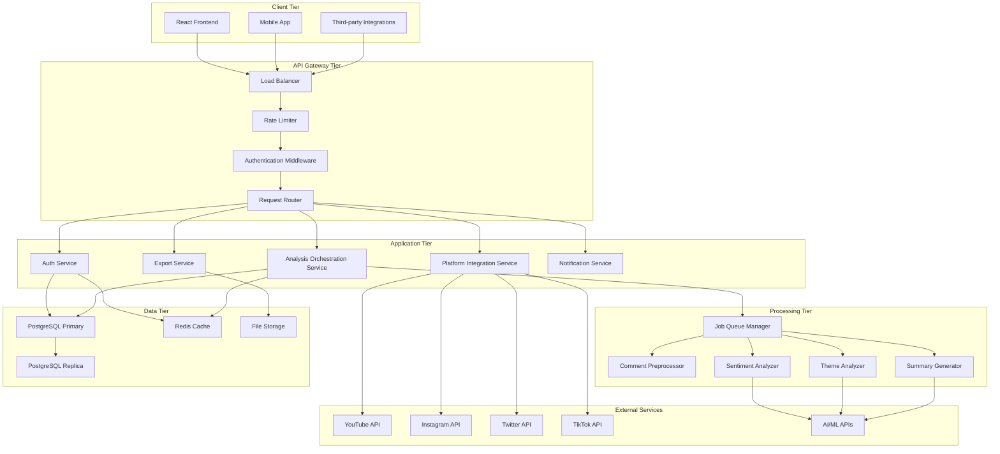
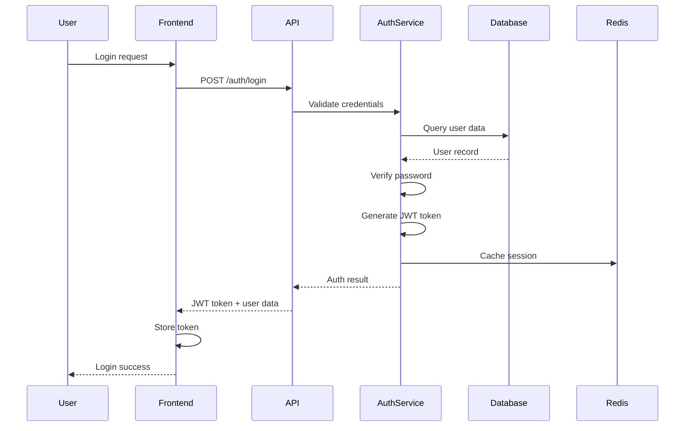
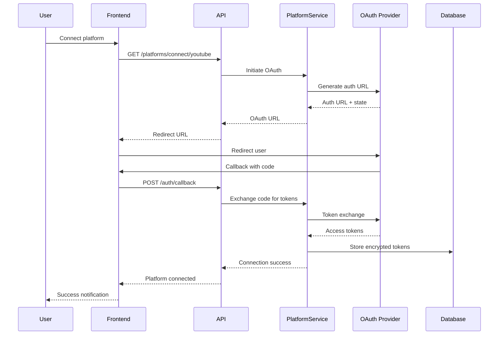
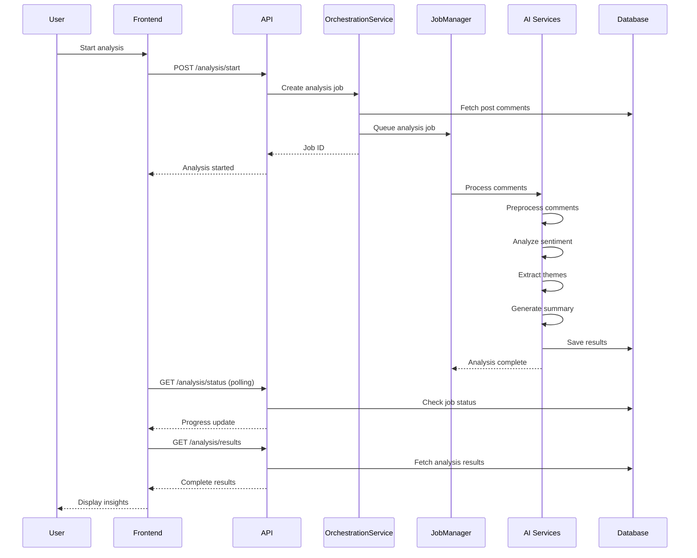
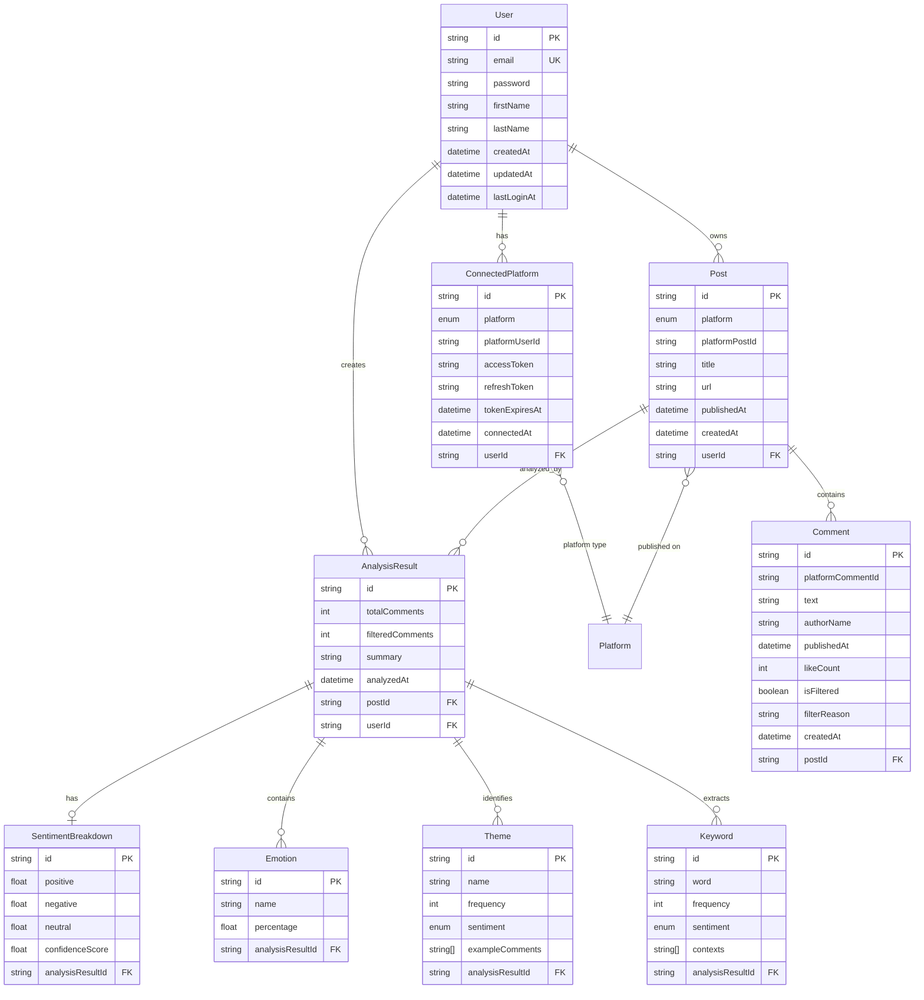
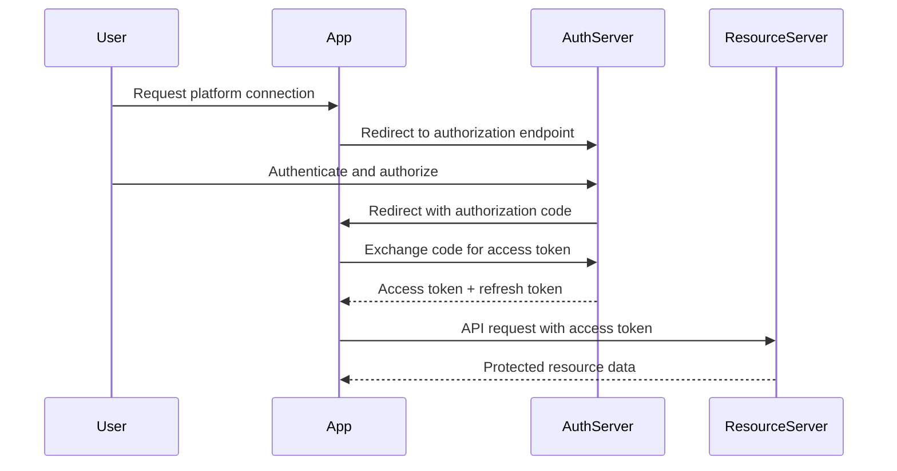
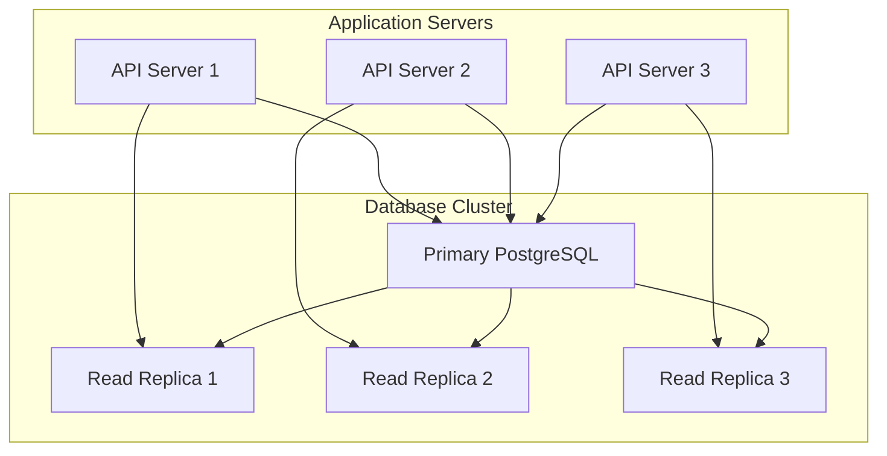

# System Architecture Documentation

## Overview

The Comment Sentiment Analyzer is a modern, scalable web application built with a microservices-inspired architecture. The system processes social media comments through AI-powered sentiment analysis, providing content creators with actionable insights about their audience engagement.

## Table of Contents

1. [Architecture Principles](#architecture-principles)
2. [System Components](#system-components)
3. [Data Flow](#data-flow)
4. [Technology Stack](#technology-stack)
5. [Database Design](#database-design)
6. [API Design](#api-design)
7. [Security Architecture](#security-architecture)
8. [Scalability and Performance](#scalability-and-performance)
9. [Monitoring and Observability](#monitoring-and-observability)
10. [Deployment Architecture](#deployment-architecture)

## Architecture Principles

### 1. Separation of Concerns

- **Frontend**: React-based SPA for user interface
- **Backend**: Node.js API server for business logic
- **Database**: PostgreSQL for persistent data storage
- **Cache**: Redis for session management and performance
- **AI Services**: Dedicated services for sentiment analysis

### 2. Scalability First

- Stateless API design for horizontal scaling
- Background job processing for long-running tasks
- Database connection pooling and query optimization
- Caching strategies at multiple levels

### 3. Security by Design

- JWT-based authentication with secure token management
- OAuth integration for social media platforms
- Data encryption at rest and in transit
- Input validation and sanitization

### 4. Observability

- Comprehensive logging with correlation IDs
- Performance monitoring and metrics collection
- Error tracking and alerting
- Health checks and status monitoring

## System Components

### High-Level Architecture



### Component Descriptions

#### 1. Frontend Layer (React SPA)

- **Purpose**: User interface and experience
- **Technology**: React 18, TypeScript, TanStack Query, Tailwind CSS
- **Responsibilities**:
  - User authentication and session management
  - Social media platform connection interface
  - Post selection and analysis initiation
  - Real-time progress tracking
  - Results visualization and export

#### 2. API Gateway Layer

- **Purpose**: Request routing, authentication, and rate limiting
- **Components**:
  - **Load Balancer**: Distributes incoming requests across API instances
  - **Rate Limiter**: Prevents API abuse and ensures fair usage
  - **Authentication Middleware**: Validates JWT tokens and manages sessions
  - **Request Router**: Routes requests to appropriate service handlers

#### 3. Application Services Layer

##### Authentication Service

```typescript
/**
 * Handles user authentication, registration, and session management
 *
 * Key Features:
 * - Secure password hashing with bcrypt
 * - JWT token generation and validation
 * - Redis-based session caching
 * - Password strength validation
 */
class AuthService {
  // User registration with email verification
  static async register(data: RegisterData): Promise<AuthResult>;

  // User login with credential validation
  static async login(data: LoginData): Promise<AuthResult>;

  // JWT token verification and user retrieval
  static async verifyToken(token: string): Promise<User | null>;

  // Session invalidation and cleanup
  static async logout(userId: string): Promise<void>;
}
```

##### Platform Integration Service

```typescript
/**
 * Manages OAuth connections and data fetching from social media platforms
 *
 * Key Features:
 * - OAuth 2.0 flow implementation for each platform
 * - Automatic token refresh mechanisms
 * - Rate limiting and error handling
 * - Unified interface for different platforms
 */
class PlatformIntegrationService {
  // Initiate OAuth connection flow
  async connectPlatform(platform: Platform, userId: string): Promise<OAuthUrl>;

  // Fetch user posts from connected platforms
  async fetchUserPosts(platform: Platform, userId: string): Promise<Post[]>;

  // Fetch comments for a specific post
  async fetchPostComments(platform: Platform, postId: string): Promise<Comment[]>;
}
```

##### Analysis Orchestration Service

```typescript
/**
 * Coordinates the complete sentiment analysis pipeline
 *
 * Analysis Pipeline:
 * 1. Comment preprocessing and filtering
 * 2. Sentiment analysis with AI models
 * 3. Theme extraction and clustering
 * 4. Summary generation
 * 5. Result persistence and caching
 */
class AnalysisOrchestrationService {
  // Execute complete analysis pipeline
  async processAnalysis(jobId: string, postId: string, userId: string): Promise<void>;

  // Validate analysis prerequisites
  async validatePrerequisites(postId: string, userId: string): Promise<ValidationResult>;

  // Estimate analysis completion time
  estimateAnalysisTime(commentCount: number): number;
}
```

#### 4. Processing Layer (AI/ML Services)

##### Comment Preprocessor

```typescript
/**
 * Cleans and filters comments before analysis
 *
 * Processing Steps:
 * - Text normalization and cleaning
 * - Spam detection using rule-based and ML approaches
 * - Toxicity filtering for harmful content
 * - Language detection and filtering
 */
class CommentPreprocessor {
  async preprocessComments(comments: Comment[]): Promise<PreprocessingResult>;

  private detectSpam(comment: Comment): boolean;
  private detectToxicity(comment: Comment): boolean;
  private normalizeText(text: string): string;
}
```

##### Sentiment Analyzer

```typescript
/**
 * Performs sentiment analysis using AI models
 *
 * Features:
 * - Multi-class sentiment classification (positive/negative/neutral)
 * - Emotion detection (joy, anger, surprise, fear, sadness, disgust)
 * - Confidence scoring for each prediction
 * - Batch processing for efficiency
 */
class SentimentAnalyzer {
  async analyzeBatchSentiment(comments: Comment[]): Promise<SentimentResult>;

  private classifySentiment(text: string): Promise<SentimentPrediction>;
  private detectEmotions(text: string): Promise<EmotionPrediction[]>;
}
```

##### Theme Analyzer

```typescript
/**
 * Extracts themes and keywords from comments
 *
 * Features:
 * - Semantic similarity clustering
 * - Keyword frequency analysis
 * - Topic modeling and theme identification
 * - Representative comment selection
 */
class ThemeAnalyzer {
  async analyzeThemes(comments: Comment[], sentiments: SentimentResult[]): Promise<ThemeResult>;

  private clusterComments(comments: Comment[]): Promise<CommentCluster[]>;
  private extractKeywords(comments: Comment[]): Promise<Keyword[]>;
}
```

##### Summary Generator

```typescript
/**
 * Generates human-readable summaries and insights
 *
 * Features:
 * - AI-powered summary generation
 * - Key insight extraction
 * - Trend identification
 * - Actionable recommendations
 */
class SummaryGenerator {
  async generateSummary(analysisData: AnalysisData): Promise<SummaryResult>;

  private generateTextSummary(data: AnalysisData): Promise<string>;
  private extractInsights(data: AnalysisData): Promise<Insight[]>;
}
```

## Data Flow

### 1. User Authentication Flow



### 2. Platform Connection Flow



### 3. Analysis Processing Flow



## Technology Stack

### Backend Technologies

#### Core Framework

- **Node.js**: Runtime environment for JavaScript execution
- **Express.js**: Web application framework for API development
- **TypeScript**: Type-safe JavaScript for better development experience

#### Database and ORM

- **PostgreSQL**: Primary relational database for data persistence
- **Prisma**: Type-safe ORM with auto-generated TypeScript types
- **Prisma Accelerate**: Connection pooling and query caching

#### Caching and Session Management

- **Redis**: In-memory data store for caching and session management
- **Redis Cluster**: High availability and horizontal scaling

#### Authentication and Security

- **JWT (jsonwebtoken)**: Token-based authentication
- **bcrypt**: Password hashing and verification
- **Passport.js**: OAuth integration for social media platforms

#### AI and Machine Learning

- **OpenAI GPT**: Advanced language model for sentiment analysis
- **Google Gemini**: Alternative AI model for analysis tasks
- **Natural Language Processing**: Text preprocessing and analysis

#### Background Processing

- **Bull Queue**: Redis-based job queue for background processing
- **Node.js Worker Threads**: CPU-intensive task processing

### Frontend Technologies

#### Core Framework

- **React 18**: Modern UI library with concurrent features
- **Next.js**: Full-stack React framework with SSR/SSG
- **TypeScript**: Type safety for frontend development

#### State Management

- **TanStack Query**: Server state management and caching
- **Zustand**: Client state management for UI state

#### UI and Styling

- **Tailwind CSS**: Utility-first CSS framework
- **shadcn/ui**: Reusable component library
- **Framer Motion**: Animation library for smooth transitions

#### Data Visualization

- **Chart.js**: Interactive charts for sentiment data
- **D3.js**: Custom visualizations for complex data
- **React Chart.js 2**: React wrapper for Chart.js

### DevOps and Infrastructure

#### Containerization

- **Docker**: Application containerization
- **Docker Compose**: Multi-container development environment

#### Monitoring and Logging

- **Winston**: Structured logging for Node.js
- **Prometheus**: Metrics collection and monitoring
- **Grafana**: Metrics visualization and dashboards

#### Testing

- **Jest**: Unit and integration testing
- **Playwright**: End-to-end testing
- **Supertest**: API endpoint testing

## Database Design

### Entity Relationship Diagram



### Database Optimization Strategies

#### Indexing Strategy

```sql
-- Primary indexes for fast lookups
CREATE INDEX idx_user_email ON users(email);
CREATE INDEX idx_connected_platform_user_platform ON connected_platforms(user_id, platform);
CREATE INDEX idx_post_user_platform ON posts(user_id, platform);
CREATE INDEX idx_comment_post_published ON comments(post_id, published_at);
CREATE INDEX idx_analysis_result_user_analyzed ON analysis_results(user_id, analyzed_at);

-- Composite indexes for complex queries
CREATE INDEX idx_post_platform_published ON posts(platform, published_at DESC);
CREATE INDEX idx_comment_filtered_published ON comments(is_filtered, published_at DESC);

-- Partial indexes for filtered queries
CREATE INDEX idx_active_platforms ON connected_platforms(user_id)
WHERE token_expires_at > NOW();

CREATE INDEX idx_unfiltered_comments ON comments(post_id, published_at)
WHERE is_filtered = false;
```

#### Query Optimization

- Use Prisma's `include` and `select` for efficient data fetching
- Implement cursor-based pagination for large datasets
- Utilize database connection pooling with Prisma
- Cache frequently accessed data in Redis

#### Data Archival Strategy

- Archive old analysis results after 1 year
- Compress historical comment data
- Implement soft deletes for user data compliance

## API Design

### RESTful API Principles

#### Resource-Based URLs

```
GET    /users/{id}                    # Get user profile
PUT    /users/{id}                    # Update user profile
GET    /platforms                     # List connected platforms
POST   /platforms/connect/{platform}  # Connect platform
DELETE /platforms/{id}                # Disconnect platform
GET    /posts                         # List user posts
GET    /posts/{id}                    # Get specific post
POST   /analysis/start                # Start analysis
GET    /analysis/{id}/status          # Get analysis status
GET    /analysis/{id}/results         # Get analysis results
```

#### HTTP Status Codes

- `200 OK`: Successful GET, PUT requests
- `201 Created`: Successful POST requests
- `204 No Content`: Successful DELETE requests
- `400 Bad Request`: Invalid request data
- `401 Unauthorized`: Authentication required
- `403 Forbidden`: Insufficient permissions
- `404 Not Found`: Resource not found
- `409 Conflict`: Resource conflict
- `429 Too Many Requests`: Rate limit exceeded
- `500 Internal Server Error`: Server error

#### Response Format Consistency

```typescript
interface ApiResponse<T> {
  success: boolean;
  data?: T;
  error?: {
    message: string;
    code: string;
    details?: any;
  };
  pagination?: {
    page: number;
    limit: number;
    total: number;
    hasNext: boolean;
  };
}
```

### API Versioning Strategy

- URL-based versioning: `/api/v1/`, `/api/v2/`
- Backward compatibility for at least 2 versions
- Deprecation notices with migration guides
- Semantic versioning for breaking changes

## Security Architecture

### Authentication and Authorization

#### JWT Token Structure

```json
{
  "header": {
    "alg": "HS256",
    "typ": "JWT"
  },
  "payload": {
    "userId": "user_123",
    "email": "user@example.com",
    "iat": 1642248000,
    "exp": 1642851600
  }
}
```

#### OAuth 2.0 Flow



### Data Protection

#### Encryption at Rest

- Database encryption using PostgreSQL's built-in encryption
- OAuth tokens encrypted with AES-256 before storage
- Sensitive configuration stored in encrypted environment variables

#### Encryption in Transit

- TLS 1.3 for all API communications
- Certificate pinning for mobile applications
- HSTS headers for web security

#### Data Sanitization

```typescript
// Input validation and sanitization
import { body, validationResult } from "express-validator";
import DOMPurify from "isomorphic-dompurify";

const validateAndSanitize = [
  body("email").isEmail().normalizeEmail(),
  body("password")
    .isLength({ min: 8 })
    .matches(/^(?=.*[a-z])(?=.*[A-Z])(?=.*\d)(?=.*[@$!%*?&])/),
  body("content").customSanitizer((value) => DOMPurify.sanitize(value)),
];
```

### Security Headers

```typescript
// Security middleware configuration
app.use(
  helmet({
    contentSecurityPolicy: {
      directives: {
        defaultSrc: ["'self'"],
        styleSrc: ["'self'", "'unsafe-inline'"],
        scriptSrc: ["'self'"],
        imgSrc: ["'self'", "data:", "https:"],
      },
    },
    hsts: {
      maxAge: 31536000,
      includeSubDomains: true,
      preload: true,
    },
  })
);
```

## Scalability and Performance

### Horizontal Scaling Strategy

#### API Server Scaling

- Stateless API design for easy horizontal scaling
- Load balancing with health checks
- Auto-scaling based on CPU and memory metrics
- Container orchestration with Kubernetes

#### Database Scaling



#### Caching Strategy

- **L1 Cache**: Application-level caching with in-memory storage
- **L2 Cache**: Redis cluster for distributed caching
- **L3 Cache**: CDN for static assets and API responses

### Performance Optimization

#### Database Optimization

- Connection pooling with optimal pool sizes
- Query optimization with proper indexing
- Materialized views for complex aggregations
- Partitioning for large tables

#### API Performance

- Response compression with gzip
- Pagination for large datasets
- Field selection to minimize payload size
- Async processing for long-running operations

#### Frontend Performance

- Code splitting and lazy loading
- Image optimization and lazy loading
- Service worker for offline functionality
- Bundle size optimization

## Monitoring and Observability

### Logging Strategy

#### Structured Logging

```typescript
import winston from "winston";

const logger = winston.createLogger({
  level: "info",
  format: winston.format.combine(winston.format.timestamp(), winston.format.errors({ stack: true }), winston.format.json()),
  defaultMeta: {
    service: "comment-analyzer-api",
    version: process.env.APP_VERSION,
  },
  transports: [
    new winston.transports.File({ filename: "error.log", level: "error" }),
    new winston.transports.File({ filename: "combined.log" }),
    new winston.transports.Console({
      format: winston.format.simple(),
    }),
  ],
});
```

#### Log Correlation

- Correlation IDs for request tracking
- User context in all log entries
- Performance metrics logging
- Error context and stack traces

### Metrics Collection

#### Application Metrics

- Request rate and response times
- Error rates and types
- Database query performance
- Cache hit/miss ratios
- Background job processing times

#### Business Metrics

- User registration and login rates
- Platform connection success rates
- Analysis completion rates
- Export generation metrics
- User engagement metrics

### Health Monitoring

#### Health Check Endpoints

```typescript
// Health check implementation
app.get("/health", async (req, res) => {
  const health = {
    status: "healthy",
    timestamp: new Date().toISOString(),
    checks: {
      database: await checkDatabase(),
      redis: await checkRedis(),
      externalApis: await checkExternalApis(),
    },
  };

  const isHealthy = Object.values(health.checks).every((check) => check.status === "healthy");

  res.status(isHealthy ? 200 : 503).json(health);
});
```

#### Alerting Strategy

- Critical alerts for system failures
- Warning alerts for performance degradation
- Business metric alerts for unusual patterns
- Escalation procedures for different alert types

## Deployment Architecture

### Container Strategy

#### Dockerfile Optimization

```dockerfile
# Multi-stage build for optimized production image
FROM node:18-alpine AS builder
WORKDIR /app
COPY package*.json ./
RUN npm ci --only=production

FROM node:18-alpine AS production
WORKDIR /app
COPY --from=builder /app/node_modules ./node_modules
COPY . .
RUN npm run build
EXPOSE 3000
CMD ["npm", "start"]
```

#### Docker Compose for Development

```yaml
version: "3.8"
services:
  api:
    build: .
    ports:
      - "3000:5628"
    environment:
      - NODE_ENV=development
      - DATABASE_URL=postgresql://user:pass@db:5432/analyzer
      - REDIS_URL=redis://redis:6379
    depends_on:
      - db
      - redis

  db:
    image: postgres:15-alpine
    environment:
      - POSTGRES_DB=analyzer
      - POSTGRES_USER=user
      - POSTGRES_PASSWORD=pass
    volumes:
      - postgres_data:/var/lib/postgresql/data

  redis:
    image: redis:7-alpine
    volumes:
      - redis_data:/data

volumes:
  postgres_data:
  redis_data:
```

### Production Deployment

#### Kubernetes Deployment

```yaml
apiVersion: apps/v1
kind: Deployment
metadata:
  name: comment-analyzer-api
spec:
  replicas: 3
  selector:
    matchLabels:
      app: comment-analyzer-api
  template:
    metadata:
      labels:
        app: comment-analyzer-api
    spec:
      containers:
        - name: api
          image: comment-analyzer/api:latest
          ports:
            - containerPort: 3000
          env:
            - name: DATABASE_URL
              valueFrom:
                secretKeyRef:
                  name: db-secret
                  key: url
          resources:
            requests:
              memory: "256Mi"
              cpu: "250m"
            limits:
              memory: "512Mi"
              cpu: "500m"
          livenessProbe:
            httpGet:
              path: /health
              port: 3000
            initialDelaySeconds: 30
            periodSeconds: 10
          readinessProbe:
            httpGet:
              path: /ready
              port: 3000
            initialDelaySeconds: 5
            periodSeconds: 5
```

### CI/CD Pipeline

#### GitHub Actions Workflow

```yaml
name: CI/CD Pipeline

on:
  push:
    branches: [main, develop]
  pull_request:
    branches: [main]

jobs:
  test:
    runs-on: ubuntu-latest
    steps:
      - uses: actions/checkout@v3
      - uses: actions/setup-node@v3
        with:
          node-version: "18"
      - run: npm ci
      - run: npm run test
      - run: npm run test:e2e

  build:
    needs: test
    runs-on: ubuntu-latest
    steps:
      - uses: actions/checkout@v3
      - uses: docker/build-push-action@v3
        with:
          push: true
          tags: comment-analyzer/api:${{ github.sha }}

  deploy:
    needs: build
    runs-on: ubuntu-latest
    if: github.ref == 'refs/heads/main'
    steps:
      - name: Deploy to Production
        run: |
          kubectl set image deployment/comment-analyzer-api \
            api=comment-analyzer/api:${{ github.sha }}
```

## Conclusion

This architecture provides a solid foundation for the Comment Sentiment Analyzer system, emphasizing scalability, security, and maintainability. The modular design allows for independent scaling of components, while comprehensive monitoring ensures system reliability and performance.

Key architectural benefits:

- **Scalability**: Horizontal scaling capabilities for all components
- **Security**: Multi-layered security with encryption and authentication
- **Performance**: Optimized database queries and caching strategies
- **Maintainability**: Clear separation of concerns and comprehensive documentation
- **Observability**: Detailed logging, metrics, and monitoring

The system is designed to handle growth from startup scale to enterprise-level usage while maintaining code quality and system reliability.
