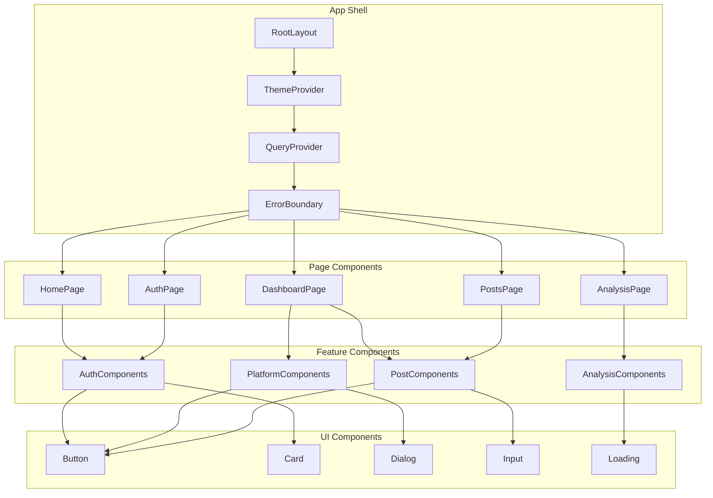

# Frontend Component Hierarchy and Documentation

## Overview

The Comment Sentiment Analyzer frontend is built with React 18, Next.js 14, and TypeScript, following modern React patterns and best practices. This document provides comprehensive documentation of the component hierarchy, state management patterns, and architectural decisions.

## Table of Contents

1. [Component Architecture](#component-architecture)
2. [State Management](#state-management)
3. [Component Documentation](#component-documentation)
4. [Hooks and Utilities](#hooks-and-utilities)
5. [Type Safety](#type-safety)
6. [Performance Optimization](#performance-optimization)
7. [Testing Strategy](#testing-strategy)

## Component Architecture

### High-Level Component Structure



### Directory Structure

```
frontend/src/
├── app/                          # Next.js App Router pages
│   ├── layout.tsx               # Root layout with providers
│   ├── page.tsx                 # Home page
│   ├── auth/
│   │   └── page.tsx            # Authentication page
│   ├── dashboard/
│   │   └── page.tsx            # Main dashboard
│   ├── analysis/
│   │   ├── [id]/
│   │   │   └── page.tsx        # Individual analysis view
│   │   ├── compare/
│   │   │   └── page.tsx        # Analysis comparison
│   │   └── history/
│   │       └── page.tsx        # Analysis history
│   └── posts/
│       └── page.tsx            # Posts management
├── components/                   # Reusable components
│   ├── ui/                      # Base UI components
│   ├── auth/                    # Authentication components
│   ├── platforms/               # Platform connection components
│   ├── posts/                   # Post management components
│   ├── analysis/                # Analysis result components
│   ├── error-boundary.tsx       # Error boundary component
│   ├── theme-provider.tsx       # Theme context provider
│   └── query-provider.tsx       # TanStack Query provider
├── hooks/                       # Custom React hooks
├── lib/                         # Utility libraries
├── types/                       # TypeScript type definitions
└── styles/                      # Global styles and themes
```

## State Management

### State Management Architecture

The application uses a hybrid approach to state management:

1. **Server State**: TanStack Query for API data and caching
2. **Client State**: React's built-in state (useState, useReducer)
3. **Global State**: Context API for theme and authentication
4. **Form State**: React Hook Form for form management

### TanStack Query Integration

```typescript
/**
 * Query Client Configuration
 *
 * Provides optimized caching, background refetching, and error handling
 * for all server state management throughout the application.
 */
import { QueryClient } from "@tanstack/react-query";

export const queryClient = new QueryClient({
  defaultOptions: {
    queries: {
      // Cache data for 5 minutes
      staleTime: 5 * 60 * 1000,
      // Keep data in cache for 10 minutes
      cacheTime: 10 * 60 * 1000,
      // Retry failed requests 3 times
      retry: 3,
      // Refetch on window focus
      refetchOnWindowFocus: false,
      // Error handling
      onError: (error) => {
        console.error("Query error:", error);
      },
    },
    mutations: {
      // Retry failed mutations once
      retry: 1,
      // Error handling
      onError: (error) => {
        console.error("Mutation error:", error);
      },
    },
  },
});
```

### Authentication State Management

```typescript
/**
 * Authentication Context
 *
 * Manages user authentication state, token storage, and session management
 * across the entire application with automatic token refresh.
 */
import { createContext, useContext, useEffect, useState } from "react";
import { User } from "@/types";
import { apiClient } from "@/lib/api-client";

interface AuthContextType {
  user: User | null;
  isAuthenticated: boolean;
  isLoading: boolean;
  login: (email: string, password: string) => Promise<void>;
  logout: () => void;
  refreshUser: () => Promise<void>;
}

const AuthContext = createContext<AuthContextType | undefined>(undefined);

export function AuthProvider({ children }: { children: React.ReactNode }) {
  const [user, setUser] = useState<User | null>(null);
  const [isLoading, setIsLoading] = useState(true);

  // Initialize authentication state on app load
  useEffect(() => {
    initializeAuth();
  }, []);

  const initializeAuth = async () => {
    try {
      const token = localStorage.getItem("auth_token");
      if (token) {
        apiClient.setToken(token);
        const response = await apiClient.getProfile();
        if (response.success && response.data) {
          setUser(response.data);
        } else {
          // Invalid token, clear it
          localStorage.removeItem("auth_token");
          apiClient.setToken(null);
        }
      }
    } catch (error) {
      console.error("Auth initialization error:", error);
      localStorage.removeItem("auth_token");
      apiClient.setToken(null);
    } finally {
      setIsLoading(false);
    }
  };

  const login = async (email: string, password: string) => {
    const response = await apiClient.login({ email, password });
    if (response.success && response.data) {
      setUser(response.data.user);
      // Token is automatically set by apiClient
    } else {
      throw new Error(response.error?.userMessage || "Login failed");
    }
  };

  const logout = () => {
    setUser(null);
    localStorage.removeItem("auth_token");
    apiClient.setToken(null);
  };

  const refreshUser = async () => {
    const response = await apiClient.getProfile();
    if (response.success && response.data) {
      setUser(response.data);
    }
  };

  return (
    <AuthContext.Provider
      value={{
        user,
        isAuthenticated: !!user,
        isLoading,
        login,
        logout,
        refreshUser,
      }}
    >
      {children}
    </AuthContext.Provider>
  );
}

export const useAuth = () => {
  const context = useContext(AuthContext);
  if (context === undefined) {
    throw new Error("useAuth must be used within an AuthProvider");
  }
  return context;
};
```

## Component Documentation

### Authentication Components

#### LoginForm Component

````typescript
/**
 * LoginForm Component
 *
 * Provides user authentication interface with form validation,
 * error handling, and loading states. Integrates with the global
 * authentication context for seamless user experience.
 *
 * @component
 * @example
 * ```tsx
 * <LoginForm
 *   onSuccess={() => router.push('/dashboard')}
 *   onSwitchToRegister={() => setMode('register')}
 * />
 * ```
 */
import { useState } from "react";
import { useForm } from "react-hook-form";
import { zodResolver } from "@hookform/resolvers/zod";
import { z } from "zod";
import { Button } from "@/components/ui/button";
import { Input } from "@/components/ui/input";
import { useAuth } from "@/hooks/use-auth";

// Form validation schema
const loginSchema = z.object({
  email: z.string().email("Please enter a valid email address"),
  password: z.string().min(1, "Password is required"),
});

type LoginFormData = z.infer<typeof loginSchema>;

interface LoginFormProps {
  /** Callback function called on successful login */
  onSuccess?: () => void;
  /** Callback function to switch to registration mode */
  onSwitchToRegister?: () => void;
  /** Additional CSS classes */
  className?: string;
}

export function LoginForm({ onSuccess, onSwitchToRegister, className }: LoginFormProps) {
  const [isLoading, setIsLoading] = useState(false);
  const [error, setError] = useState<string | null>(null);
  const { login } = useAuth();

  const {
    register,
    handleSubmit,
    formState: { errors },
  } = useForm<LoginFormData>({
    resolver: zodResolver(loginSchema),
  });

  const onSubmit = async (data: LoginFormData) => {
    setIsLoading(true);
    setError(null);

    try {
      await login(data.email, data.password);
      onSuccess?.();
    } catch (err) {
      setError(err instanceof Error ? err.message : "Login failed");
    } finally {
      setIsLoading(false);
    }
  };

  return (
    <form onSubmit={handleSubmit(onSubmit)} className={className}>
      <div className="space-y-4">
        <div>
          <Input {...register("email")} type="email" placeholder="Email address" disabled={isLoading} error={errors.email?.message} />
        </div>

        <div>
          <Input {...register("password")} type="password" placeholder="Password" disabled={isLoading} error={errors.password?.message} />
        </div>

        {error && <div className="text-sm text-red-600 bg-red-50 p-3 rounded-md">{error}</div>}

        <Button type="submit" disabled={isLoading} className="w-full">
          {isLoading ? "Signing in..." : "Sign in"}
        </Button>

        {onSwitchToRegister && (
          <div className="text-center">
            <button type="button" onClick={onSwitchToRegister} className="text-sm text-blue-600 hover:text-blue-500">
              Don't have an account? Sign up
            </button>
          </div>
        )}
      </div>
    </form>
  );
}
````

### Platform Connection Components

#### PlatformCard Component

````typescript
/**
 * PlatformCard Component
 *
 * Displays social media platform connection status with interactive
 * connection/disconnection functionality. Provides visual feedback
 * for connection states and error handling.
 *
 * @component
 * @example
 * ```tsx
 * <PlatformCard
 *   platform="YOUTUBE"
 *   isConnected={true}
 *   lastSync="2024-01-15T10:30:00Z"
 *   onConnect={() => handleConnect('YOUTUBE')}
 *   onDisconnect={() => handleDisconnect('YOUTUBE')}
 * />
 * ```
 */
import { useState } from "react";
import { Platform } from "@/types";
import { Button } from "@/components/ui/button";
import { Card } from "@/components/ui/card";
import { Badge } from "@/components/ui/badge";

interface PlatformCardProps {
  /** Social media platform type */
  platform: Platform;
  /** Whether the platform is currently connected */
  isConnected: boolean;
  /** Last successful sync timestamp */
  lastSync?: string;
  /** Error message if connection has issues */
  error?: string;
  /** Platform username or handle */
  username?: string;
  /** Callback function for connecting platform */
  onConnect: () => Promise<void>;
  /** Callback function for disconnecting platform */
  onDisconnect: () => Promise<void>;
  /** Loading state for connection operations */
  isLoading?: boolean;
}

const platformConfig = {
  YOUTUBE: {
    name: "YouTube",
    icon: "📺",
    color: "bg-red-500",
    description: "Connect to analyze video comments",
  },
  INSTAGRAM: {
    name: "Instagram",
    icon: "📷",
    color: "bg-pink-500",
    description: "Connect to analyze post comments",
  },
  TWITTER: {
    name: "Twitter/X",
    icon: "🐦",
    color: "bg-blue-500",
    description: "Connect to analyze tweet replies",
  },
  TIKTOK: {
    name: "TikTok",
    icon: "🎵",
    color: "bg-black",
    description: "Connect to analyze video comments",
  },
};

export function PlatformCard({ platform, isConnected, lastSync, error, username, onConnect, onDisconnect, isLoading = false }: PlatformCardProps) {
  const [actionLoading, setActionLoading] = useState(false);
  const config = platformConfig[platform];

  const handleConnect = async () => {
    setActionLoading(true);
    try {
      await onConnect();
    } finally {
      setActionLoading(false);
    }
  };

  const handleDisconnect = async () => {
    setActionLoading(true);
    try {
      await onDisconnect();
    } finally {
      setActionLoading(false);
    }
  };

  const formatLastSync = (timestamp: string) => {
    const date = new Date(timestamp);
    const now = new Date();
    const diffMs = now.getTime() - date.getTime();
    const diffHours = Math.floor(diffMs / (1000 * 60 * 60));

    if (diffHours < 1) return "Just now";
    if (diffHours < 24) return `${diffHours}h ago`;
    return date.toLocaleDateString();
  };

  return (
    <Card className="p-6 hover:shadow-lg transition-shadow">
      <div className="flex items-start justify-between">
        <div className="flex items-center space-x-3">
          <div className={`w-12 h-12 rounded-lg ${config.color} flex items-center justify-center text-white text-xl`}>{config.icon}</div>
          <div>
            <h3 className="font-semibold text-lg">{config.name}</h3>
            <p className="text-sm text-gray-600">{config.description}</p>
            {username && <p className="text-sm text-blue-600 mt-1">@{username}</p>}
          </div>
        </div>

        <div className="flex flex-col items-end space-y-2">
          <Badge variant={isConnected ? "success" : "secondary"} className={error ? "bg-red-100 text-red-800" : ""}>
            {error ? "Error" : isConnected ? "Connected" : "Not Connected"}
          </Badge>

          {isConnected ? (
            <Button variant="outline" size="sm" onClick={handleDisconnect} disabled={actionLoading || isLoading}>
              {actionLoading ? "Disconnecting..." : "Disconnect"}
            </Button>
          ) : (
            <Button onClick={handleConnect} disabled={actionLoading || isLoading} size="sm">
              {actionLoading ? "Connecting..." : "Connect"}
            </Button>
          )}
        </div>
      </div>

      {isConnected && lastSync && (
        <div className="mt-4 pt-4 border-t border-gray-200">
          <p className="text-sm text-gray-500">Last synced: {formatLastSync(lastSync)}</p>
        </div>
      )}

      {error && (
        <div className="mt-4 p-3 bg-red-50 border border-red-200 rounded-md">
          <p className="text-sm text-red-600">{error}</p>
        </div>
      )}
    </Card>
  );
}
````

### Analysis Components

#### AnalysisDashboard Component

````typescript
/**
 * AnalysisDashboard Component
 *
 * Main dashboard for displaying sentiment analysis results with interactive
 * charts, theme visualization, and export functionality. Provides comprehensive
 * insights about comment sentiment and audience engagement.
 *
 * @component
 * @example
 * ```tsx
 * <AnalysisDashboard
 *   analysisId="analysis_123"
 *   onExport={(format) => handleExport(format)}
 *   onCompare={(ids) => handleCompare(ids)}
 * />
 * ```
 */
import { useState, useMemo } from "react";
import { useQuery } from "@tanstack/react-query";
import { AnalysisResultWithDetails } from "@/types";
import { apiClient } from "@/lib/api-client";
import { Card } from "@/components/ui/card";
import { Button } from "@/components/ui/button";
import { SentimentChart } from "./sentiment-chart";
import { ThemeCloud } from "./theme-cloud";
import { KeywordCloud } from "./keyword-cloud";
import { EmotionIndicators } from "./emotion-indicators";
import { ExportModal } from "./export-modal";

interface AnalysisDashboardProps {
  /** Analysis result ID to display */
  analysisId: string;
  /** Callback function for exporting analysis */
  onExport?: (format: string) => void;
  /** Callback function for comparing analyses */
  onCompare?: (analysisIds: string[]) => void;
  /** Additional CSS classes */
  className?: string;
}

export function AnalysisDashboard({ analysisId, onExport, onCompare, className }: AnalysisDashboardProps) {
  const [showExportModal, setShowExportModal] = useState(false);

  // Fetch analysis results with caching
  const {
    data: analysis,
    isLoading,
    error,
    refetch,
  } = useQuery({
    queryKey: ["analysis", analysisId],
    queryFn: async () => {
      const response = await apiClient.getAnalysisResult(analysisId);
      if (!response.success) {
        throw new Error(response.error?.userMessage || "Failed to fetch analysis");
      }
      return response.data!;
    },
    staleTime: 5 * 60 * 1000, // 5 minutes
    cacheTime: 10 * 60 * 1000, // 10 minutes
  });

  // Compute derived data for visualizations
  const chartData = useMemo(() => {
    if (!analysis?.sentimentBreakdown) return null;

    return {
      labels: ["Positive", "Negative", "Neutral"],
      datasets: [
        {
          data: [analysis.sentimentBreakdown.positive, analysis.sentimentBreakdown.negative, analysis.sentimentBreakdown.neutral],
          backgroundColor: [
            "#10B981", // Green for positive
            "#EF4444", // Red for negative
            "#6B7280", // Gray for neutral
          ],
          borderWidth: 0,
        },
      ],
    };
  }, [analysis?.sentimentBreakdown]);

  const summaryStats = useMemo(() => {
    if (!analysis) return null;

    const validComments = analysis.totalComments - analysis.filteredComments;
    const filterRate = (analysis.filteredComments / analysis.totalComments) * 100;

    return {
      totalComments: analysis.totalComments,
      validComments,
      filterRate: Math.round(filterRate * 10) / 10,
      dominantSentiment: getDominantSentiment(analysis.sentimentBreakdown),
      topEmotion: analysis.emotions[0]?.name || "N/A",
      themeCount: analysis.themes.length,
      keywordCount: analysis.keywords.length,
    };
  }, [analysis]);

  const getDominantSentiment = (breakdown: any) => {
    if (!breakdown) return "Unknown";

    const sentiments = [
      { name: "Positive", value: breakdown.positive },
      { name: "Negative", value: breakdown.negative },
      { name: "Neutral", value: breakdown.neutral },
    ];

    return sentiments.reduce((max, current) => (current.value > max.value ? current : max)).name;
  };

  if (isLoading) {
    return (
      <div className="space-y-6">
        <div className="grid grid-cols-1 md:grid-cols-2 lg:grid-cols-4 gap-4">
          {[...Array(4)].map((_, i) => (
            <Card key={i} className="p-6">
              <div className="animate-pulse">
                <div className="h-4 bg-gray-200 rounded w-3/4 mb-2"></div>
                <div className="h-8 bg-gray-200 rounded w-1/2"></div>
              </div>
            </Card>
          ))}
        </div>
        <div className="grid grid-cols-1 lg:grid-cols-2 gap-6">
          {[...Array(2)].map((_, i) => (
            <Card key={i} className="p-6">
              <div className="animate-pulse">
                <div className="h-6 bg-gray-200 rounded w-1/3 mb-4"></div>
                <div className="h-64 bg-gray-200 rounded"></div>
              </div>
            </Card>
          ))}
        </div>
      </div>
    );
  }

  if (error) {
    return (
      <Card className="p-6">
        <div className="text-center">
          <p className="text-red-600 mb-4">Failed to load analysis results</p>
          <Button onClick={() => refetch()}>Try Again</Button>
        </div>
      </Card>
    );
  }

  if (!analysis) {
    return (
      <Card className="p-6">
        <p className="text-center text-gray-500">No analysis data available</p>
      </Card>
    );
  }

  return (
    <div className={`space-y-6 ${className}`}>
      {/* Header with post info and actions */}
      <div className="flex justify-between items-start">
        <div>
          <h1 className="text-2xl font-bold mb-2">Analysis Results</h1>
          <p className="text-gray-600">
            {analysis.post?.title} • {analysis.post?.platform}
          </p>
          <p className="text-sm text-gray-500">Analyzed on {new Date(analysis.analyzedAt).toLocaleDateString()}</p>
        </div>
        <div className="flex space-x-2">
          <Button variant="outline" onClick={() => setShowExportModal(true)}>
            Export Results
          </Button>
          {onCompare && (
            <Button variant="outline" onClick={() => onCompare([analysisId])}>
              Compare
            </Button>
          )}
        </div>
      </div>

      {/* Summary Statistics */}
      <div className="grid grid-cols-1 md:grid-cols-2 lg:grid-cols-4 gap-4">
        <Card className="p-6">
          <h3 className="text-sm font-medium text-gray-500 mb-1">Total Comments</h3>
          <p className="text-2xl font-bold">{summaryStats?.totalComments.toLocaleString()}</p>
        </Card>

        <Card className="p-6">
          <h3 className="text-sm font-medium text-gray-500 mb-1">Valid Comments</h3>
          <p className="text-2xl font-bold text-green-600">{summaryStats?.validComments.toLocaleString()}</p>
        </Card>

        <Card className="p-6">
          <h3 className="text-sm font-medium text-gray-500 mb-1">Dominant Sentiment</h3>
          <p className="text-2xl font-bold">{summaryStats?.dominantSentiment}</p>
        </Card>

        <Card className="p-6">
          <h3 className="text-sm font-medium text-gray-500 mb-1">Top Emotion</h3>
          <p className="text-2xl font-bold text-blue-600">{summaryStats?.topEmotion}</p>
        </Card>
      </div>

      {/* AI-Generated Summary */}
      <Card className="p-6">
        <h2 className="text-lg font-semibold mb-4">AI Summary</h2>
        <p className="text-gray-700 leading-relaxed">{analysis.summary}</p>
      </Card>

      {/* Charts and Visualizations */}
      <div className="grid grid-cols-1 lg:grid-cols-2 gap-6">
        {/* Sentiment Breakdown Chart */}
        <Card className="p-6">
          <h2 className="text-lg font-semibold mb-4">Sentiment Distribution</h2>
          {chartData && <SentimentChart data={chartData} breakdown={analysis.sentimentBreakdown} />}
        </Card>

        {/* Emotion Indicators */}
        <Card className="p-6">
          <h2 className="text-lg font-semibold mb-4">Detected Emotions</h2>
          <EmotionIndicators emotions={analysis.emotions} />
        </Card>
      </div>

      {/* Themes and Keywords */}
      <div className="grid grid-cols-1 lg:grid-cols-2 gap-6">
        {/* Theme Cloud */}
        <Card className="p-6">
          <h2 className="text-lg font-semibold mb-4">Discussion Themes ({analysis.themes.length})</h2>
          <ThemeCloud themes={analysis.themes} />
        </Card>

        {/* Keyword Cloud */}
        <Card className="p-6">
          <h2 className="text-lg font-semibold mb-4">Key Terms ({analysis.keywords.length})</h2>
          <KeywordCloud keywords={analysis.keywords} />
        </Card>
      </div>

      {/* Export Modal */}
      {showExportModal && <ExportModal analysisId={analysisId} onClose={() => setShowExportModal(false)} onExport={onExport} />}
    </div>
  );
}
````

## Hooks and Utilities

### Custom Hooks Documentation

#### useAnalysis Hook

````typescript
/**
 * useAnalysis Hook
 *
 * Custom hook for managing analysis operations including starting analysis,
 * polling for progress, and fetching results. Provides optimized caching
 * and error handling for analysis-related operations.
 *
 * @hook
 * @example
 * ```tsx
 * const {
 *   startAnalysis,
 *   getAnalysisStatus,
 *   getAnalysisResult,
 *   isStarting,
 *   error
 * } = useAnalysis();
 *
 * const handleAnalyze = async () => {
 *   const job = await startAnalysis('post_123');
 *   // Poll for completion...
 * };
 * ```
 */
import { useMutation, useQuery, useQueryClient } from "@tanstack/react-query";
import { apiClient } from "@/lib/api-client";
import { AnalysisJob, AnalysisResult } from "@/types";

export function useAnalysis() {
  const queryClient = useQueryClient();

  // Start analysis mutation
  const startAnalysisMutation = useMutation({
    mutationFn: async (postId: string) => {
      const response = await apiClient.startAnalysis(postId);
      if (!response.success) {
        throw new Error(response.error?.userMessage || "Failed to start analysis");
      }
      return response.data!;
    },
    onSuccess: (job) => {
      // Invalidate related queries
      queryClient.invalidateQueries({ queryKey: ["analysis-history"] });

      // Start polling for job status
      queryClient.setQueryData(["analysis-job", job.id], job);
    },
  });

  // Get analysis status with polling
  const useAnalysisStatus = (jobId: string | null, enabled = true) => {
    return useQuery({
      queryKey: ["analysis-job", jobId],
      queryFn: async () => {
        if (!jobId) throw new Error("Job ID is required");

        const response = await apiClient.getAnalysisStatus(jobId);
        if (!response.success) {
          throw new Error(response.error?.userMessage || "Failed to get status");
        }
        return response.data!;
      },
      enabled: enabled && !!jobId,
      refetchInterval: (data) => {
        // Stop polling when job is complete or failed
        if (data?.status === "completed" || data?.status === "failed") {
          return false;
        }
        return 2000; // Poll every 2 seconds
      },
      onSuccess: (job) => {
        // When job completes, invalidate analysis result query
        if (job.status === "completed" && job.analysisResultId) {
          queryClient.invalidateQueries({
            queryKey: ["analysis", job.analysisResultId],
          });
        }
      },
    });
  };

  // Get analysis result
  const useAnalysisResult = (analysisId: string | null) => {
    return useQuery({
      queryKey: ["analysis", analysisId],
      queryFn: async () => {
        if (!analysisId) throw new Error("Analysis ID is required");

        const response = await apiClient.getAnalysisResult(analysisId);
        if (!response.success) {
          throw new Error(response.error?.userMessage || "Failed to get results");
        }
        return response.data!;
      },
      enabled: !!analysisId,
      staleTime: 5 * 60 * 1000, // 5 minutes
    });
  };

  // Get analysis history
  const useAnalysisHistory = () => {
    return useQuery({
      queryKey: ["analysis-history"],
      queryFn: async () => {
        const response = await apiClient.getAnalysisHistory();
        if (!response.success) {
          throw new Error(response.error?.userMessage || "Failed to get history");
        }
        return response.data!;
      },
      staleTime: 2 * 60 * 1000, // 2 minutes
    });
  };

  return {
    // Mutations
    startAnalysis: startAnalysisMutation.mutateAsync,
    isStarting: startAnalysisMutation.isLoading,
    startError: startAnalysisMutation.error,

    // Queries
    useAnalysisStatus,
    useAnalysisResult,
    useAnalysisHistory,

    // Utilities
    invalidateAnalysis: (analysisId: string) => {
      queryClient.invalidateQueries({ queryKey: ["analysis", analysisId] });
    },

    invalidateHistory: () => {
      queryClient.invalidateQueries({ queryKey: ["analysis-history"] });
    },
  };
}
````

## Type Safety

### Comprehensive Type Definitions

The application maintains strict type safety throughout all components and hooks:

```typescript
/**
 * Component Props Type Definitions
 *
 * Comprehensive type definitions for all component props,
 * ensuring type safety and better developer experience.
 */

// Base component props
interface BaseComponentProps {
  className?: string;
  children?: React.ReactNode;
}

// Form component props
interface FormComponentProps extends BaseComponentProps {
  onSubmit?: (data: any) => void | Promise<void>;
  isLoading?: boolean;
  error?: string | null;
  disabled?: boolean;
}

// Data display component props
interface DataComponentProps<T> extends BaseComponentProps {
  data: T;
  isLoading?: boolean;
  error?: Error | null;
  onRefresh?: () => void;
}

// Interactive component props
interface InteractiveComponentProps extends BaseComponentProps {
  onClick?: () => void | Promise<void>;
  onSelect?: (item: any) => void;
  onCancel?: () => void;
  disabled?: boolean;
}

// Analysis-specific types
interface AnalysisComponentProps extends BaseComponentProps {
  analysisId: string;
  onExport?: (format: string) => void;
  onCompare?: (analysisIds: string[]) => void;
  onShare?: (analysisId: string) => void;
}
```

## Performance Optimization

### React Performance Patterns

#### Memoization Strategy

```typescript
/**
 * Performance Optimization Patterns
 *
 * Strategic use of React.memo, useMemo, and useCallback
 * to optimize component rendering and prevent unnecessary re-renders.
 */

// Memoized component for expensive renders
export const ExpensiveChart = React.memo(function ExpensiveChart({ data, options, onDataPointClick }: ChartProps) {
  // Memoize expensive calculations
  const processedData = useMemo(() => {
    return processChartData(data);
  }, [data]);

  // Memoize callback functions
  const handleDataPointClick = useCallback(
    (point: DataPoint) => {
      onDataPointClick?.(point);
    },
    [onDataPointClick]
  );

  return <Chart data={processedData} options={options} onDataPointClick={handleDataPointClick} />;
});

// Custom comparison function for complex props
export const ComplexComponent = React.memo(
  function ComplexComponent(props: ComplexProps) {
    // Component implementation
  },
  (prevProps, nextProps) => {
    // Custom comparison logic
    return prevProps.id === nextProps.id && prevProps.data.length === nextProps.data.length && prevProps.lastUpdated === nextProps.lastUpdated;
  }
);
```

#### Code Splitting and Lazy Loading

```typescript
/**
 * Code Splitting Strategy
 *
 * Lazy loading of components and routes to optimize bundle size
 * and improve initial page load performance.
 */

// Lazy load heavy components
const AnalysisDashboard = lazy(() => import("./analysis/analysis-dashboard"));
const ComparisonView = lazy(() => import("./analysis/comparison-dashboard"));
const ExportModal = lazy(() => import("./analysis/export-modal"));

// Lazy load pages
const DashboardPage = lazy(() => import("../app/dashboard/page"));
const AnalysisPage = lazy(() => import("../app/analysis/[id]/page"));

// Suspense wrapper with loading fallback
function LazyComponentWrapper({ children }: { children: React.ReactNode }) {
  return <Suspense fallback={<LoadingSpinner />}>{children}</Suspense>;
}
```

## Testing Strategy

### Component Testing Patterns

```typescript
/**
 * Component Testing Examples
 *
 * Comprehensive testing patterns for React components
 * using Jest and React Testing Library.
 */

import { render, screen, fireEvent, waitFor } from "@testing-library/react";
import { QueryClient, QueryClientProvider } from "@tanstack/react-query";
import { LoginForm } from "../auth/login-form";

// Test utilities
const createTestQueryClient = () =>
  new QueryClient({
    defaultOptions: {
      queries: { retry: false },
      mutations: { retry: false },
    },
  });

const renderWithProviders = (component: React.ReactElement) => {
  const queryClient = createTestQueryClient();
  return render(<QueryClientProvider client={queryClient}>{component}</QueryClientProvider>);
};

// Component tests
describe("LoginForm", () => {
  it("renders login form with email and password fields", () => {
    renderWithProviders(<LoginForm />);

    expect(screen.getByPlaceholderText("Email address")).toBeInTheDocument();
    expect(screen.getByPlaceholderText("Password")).toBeInTheDocument();
    expect(screen.getByRole("button", { name: /sign in/i })).toBeInTheDocument();
  });

  it("shows validation errors for invalid input", async () => {
    renderWithProviders(<LoginForm />);

    const submitButton = screen.getByRole("button", { name: /sign in/i });
    fireEvent.click(submitButton);

    await waitFor(() => {
      expect(screen.getByText("Please enter a valid email address")).toBeInTheDocument();
      expect(screen.getByText("Password is required")).toBeInTheDocument();
    });
  });

  it("calls onSuccess callback after successful login", async () => {
    const mockOnSuccess = jest.fn();
    renderWithProviders(<LoginForm onSuccess={mockOnSuccess} />);

    // Fill form and submit
    fireEvent.change(screen.getByPlaceholderText("Email address"), {
      target: { value: "test@example.com" },
    });
    fireEvent.change(screen.getByPlaceholderText("Password"), {
      target: { value: "password123" },
    });

    fireEvent.click(screen.getByRole("button", { name: /sign in/i }));

    await waitFor(() => {
      expect(mockOnSuccess).toHaveBeenCalled();
    });
  });
});
```

This comprehensive documentation provides a complete overview of the frontend architecture, component hierarchy, state management patterns, and development best practices for the Comment Sentiment Analyzer application.
